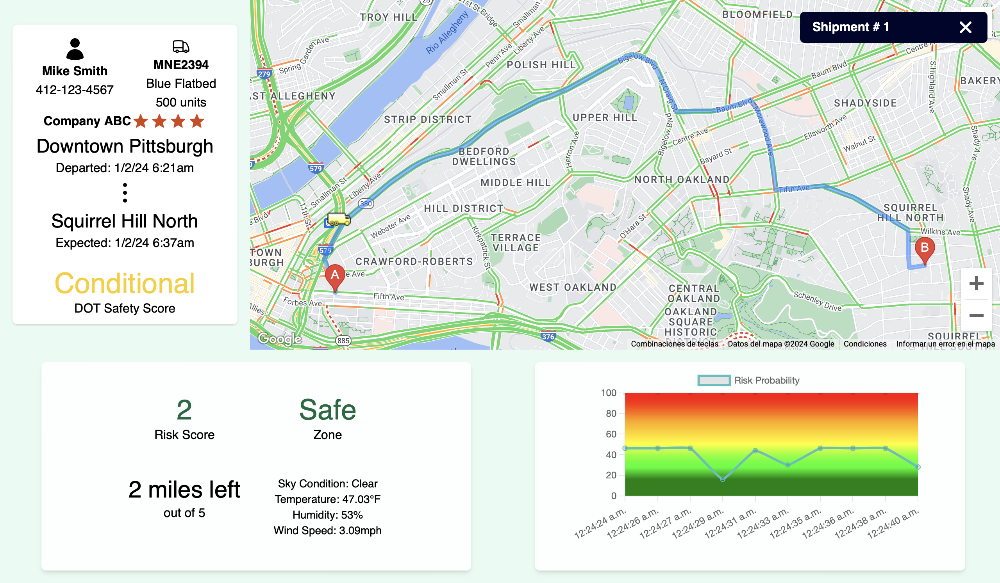
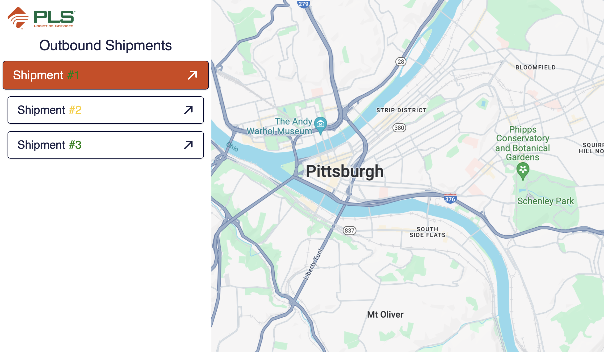

# Freight Guard - 2024 TartanHacks
Freight Guard is an administrative internal tool built for [PLS Logistics Services](https://www.plslogistics.com/). It provides early warning analysis for potential risks such as fraud, accidents, delays, and runaway theft. Freight Guard also delivers all the necessary data required for swift action-taking, ensuring prompt and effective decision-making.

**Note:**
Freight Guard is designed for optimal viewing on 13-inch screens. Additionally, if you would like to run this locally, you must first replace the API keys in ~/.env with your own.

**Examples:**

